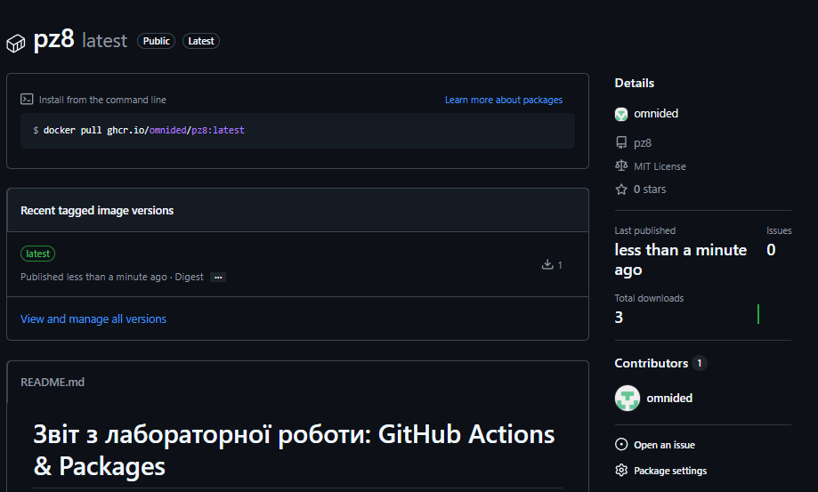

# Звіт з лабораторної роботи: GitHub Actions & Packages

## 1. Практичні роботи на GitHub Skills

У ході виконання лабораторної роботи було пройдено навчальні курси на платформі GitHub Skills. Нижче наведено посилання на створені репозиторії з виконаними завданнями:

- **Hello GitHub Actions:**
  - [Посилання на репозиторій hello-github-actions](https://github.com/omnided/hello-github-actions)
- **Publish Packages:**
  - [Посилання на репозиторій publish-packages](https://github.com/omnided/publish-packages)

---

## 2. Власний GitHub Workflow для Docker

Було створено файл конфігурації `.github/workflows/docker-publish.yml` для автоматизації збірки front-end проєкту та публікації контейнера у GitHub Container Registry.

### 2.1 Опис конфігурації

**Тригери (Triggers):**
Воркфлоу налаштовано на запуск у двох випадках:
1. **Ручний запуск** (`workflow_dispatch`) — для примусової збірки через інтерфейс GitHub.
2. **Push** — автоматичний запуск при оновленні коду в гілках:
   - `main`
   - `feature/*` (будь-яка гілка, що починається з "feature/")

**Кроки (Steps):**
1. **Checkout:** Клонування коду репозиторію.
2. **Setup & Build:** Встановлення `pnpm`, залежностей та збірка проєкту (`pnpm run build`).
3. **Login:** Авторизація в GitHub Container Registry (GHCR) з використанням `GITHUB_TOKEN`.
4. **Deploy:** Збірка Docker-образу та його відправка (push) в реєстр.

### 2.2 Код Workflow

Вміст файлу `.github/workflows/docker-publish.yml`:

```yaml
name: Build and Publish Front-end Docker Image

on:
  workflow_dispatch:
  push:
    branches:
      - main
      - 'feature/*'

permissions:
  packages: write
  contents: read

jobs:
  build-and-push:
    runs-on: ubuntu-latest

    steps:
      - name: Checkout repository
        uses: actions/checkout@v4

      # Налаштування Node.js (рекомендовано для React/Vite проєктів)
      - name: Setup Node.js
        uses: actions/setup-node@v4
        with:
          node-version: '20'

      - name: Install dependencies and build
        run: |
          npm install -g pnpm
          pnpm install
          pnpm run build

      - name: Log in to the Container registry
        uses: docker/login-action@v3
        with:
          registry: ghcr.io
          username: ${{ github.actor }}
          password: ${{ secrets.GITHUB_TOKEN }}

      - name: Build and push Docker image
        uses: docker/build-push-action@v5
        with:
          context: .
          push: true
          tags: ghcr.io/${{ github.repository }}:latest
```
### 2.3 Перевірка результатів
Після успішного виконання GitHub Action, Docker-образ з'явився у вкладці Packages профілю.

